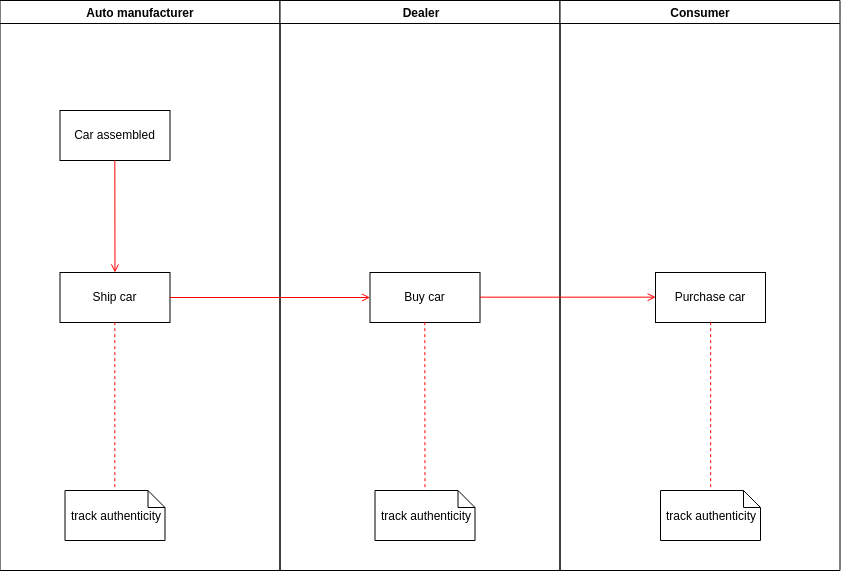
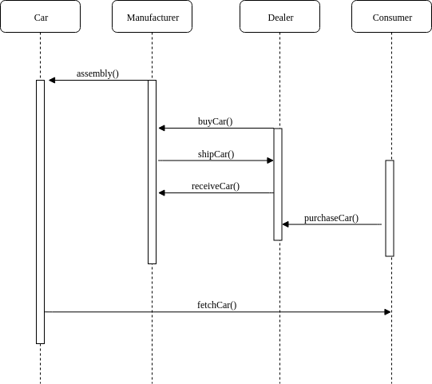
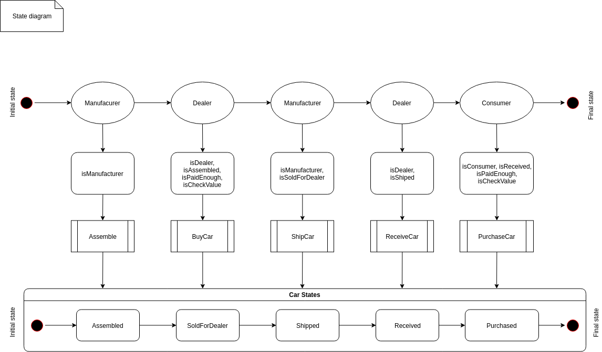
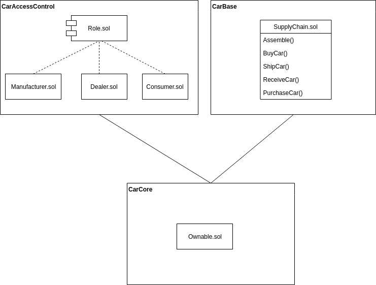

# Supply chain & data auditing

An Ethereum DApp that demonstrates a Supply Chain flow between a Seller and Buyer. 
-A Seller can add items to the inventory system stored in the blockchain. 
-A Buyer can purchase such items from the inventory system. 
-A Seller can mark an item as Shipped.
-A Buyer can mark an item as Received.

The list of UML diagrams:

Activity diagram


Sequence diagram


State diagram


Data model diagram


```
Contract address: 0xa442c0e4bF06bb59d928f20be0E0864a329F5dE2
Node: v10.16.0
Truffle: v5.0.1
Web3: v1.2.1

```

## Built With

* [Ethereum](https://www.ethereum.org/) - Ethereum is a decentralized platform that runs smart contracts
* [Truffle Framework](http://truffleframework.com/) - Truffle is the most popular development framework for Ethereum with a mission to make your life a whole lot easier.
* [Truffle Assertions] (https://www.npmjs.com/package/truffle-assertions) -  This package adds additional assertions that can be used to test Ethereum smart contracts inside Truffle tests.
